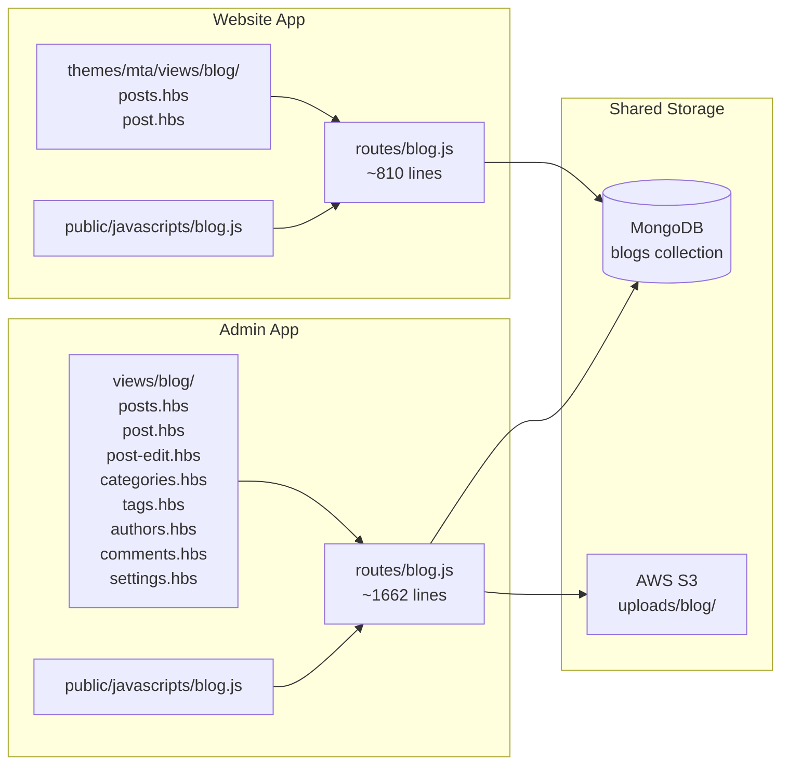
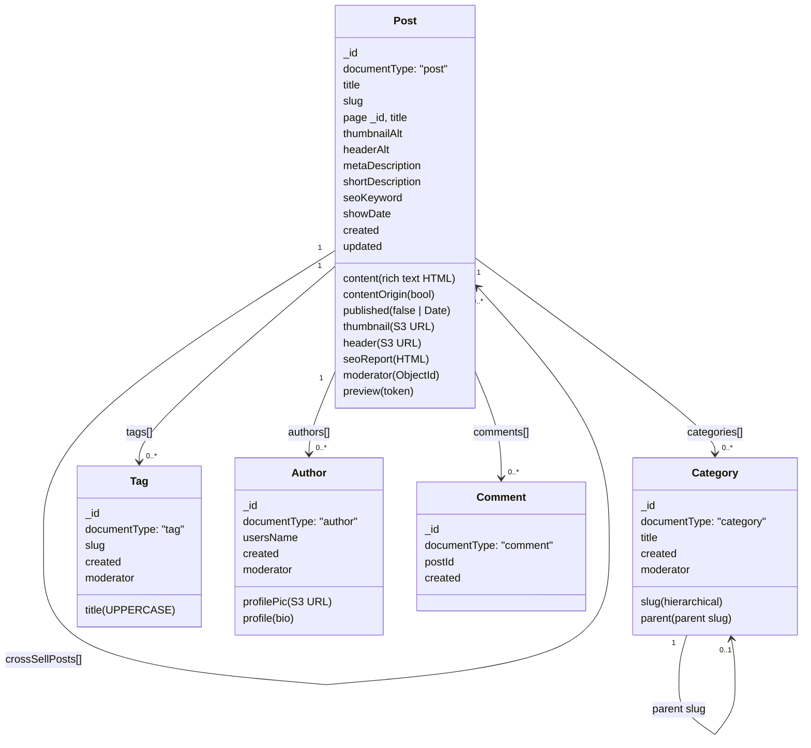
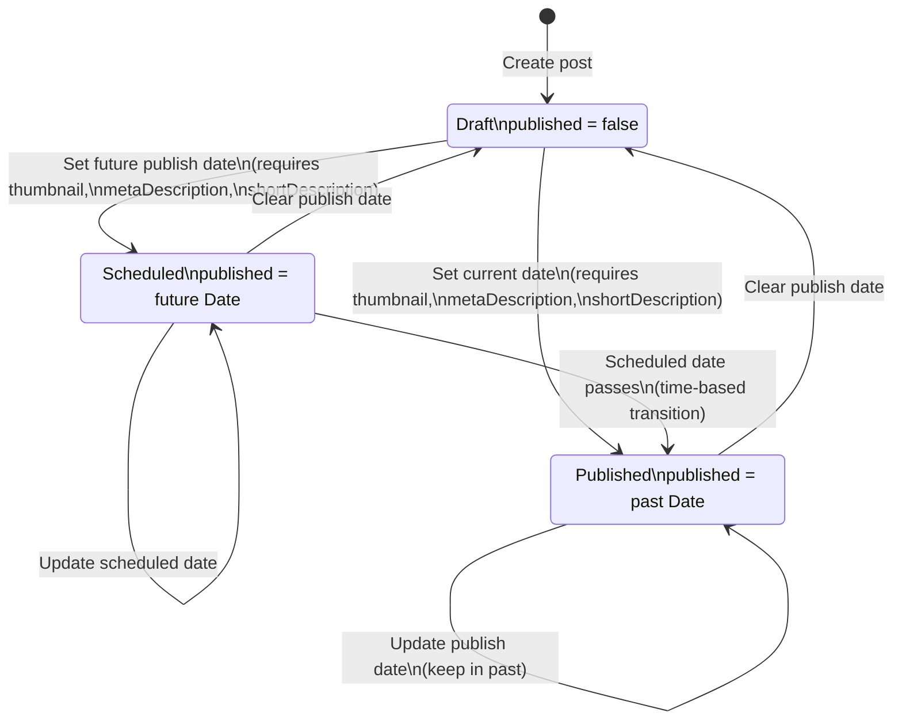
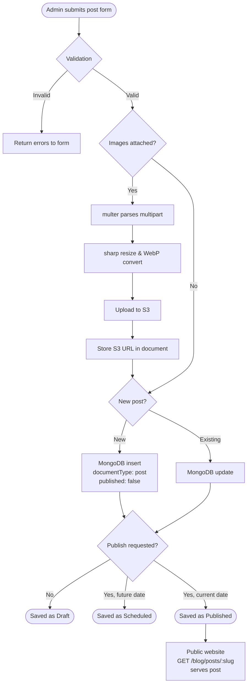
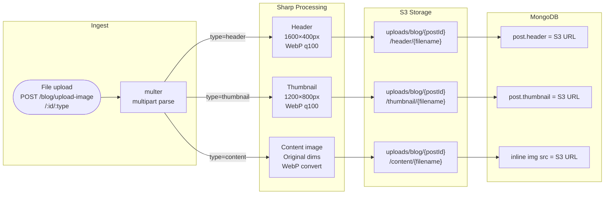
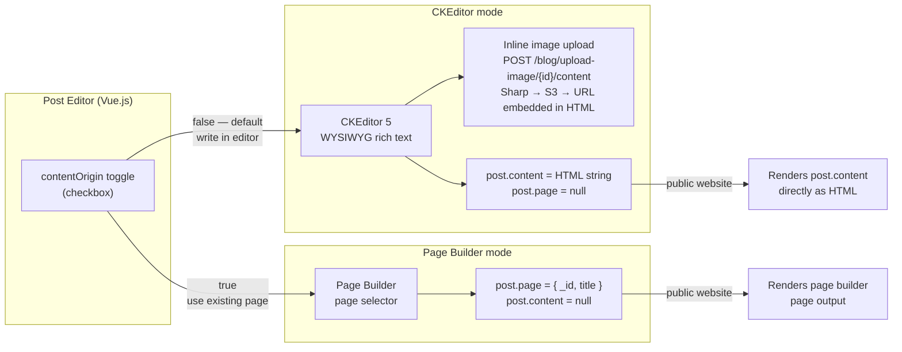
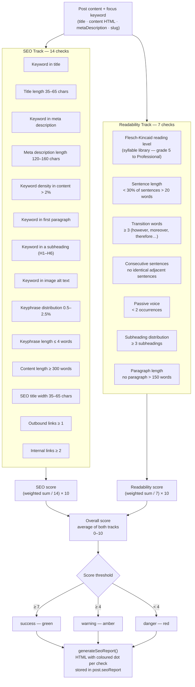

# CartAlchemy — Blog Module Architecture

The blog module powers content publishing across two Express/Handlebars apps — an admin app for content management and a public-facing website for readers. All blog content lives in a single MongoDB collection (`blogs`) differentiated by `documentType`, with images stored in S3 after processing through Sharp.

---

## 1. Module Structure



---

## 2. MongoDB Data Model

All document types reside in the single `blogs` collection — there are no separate collections per type. Relationships are embedded arrays of `{ _id, display fields }` rather than foreign-key joins; cascading deletes are handled in application logic via `$pull` operators.



---

## 3. Post Lifecycle

Status is computed dynamically in aggregation pipelines — there is no separate status field. Publishing requires `thumbnail`, `metaDescription`, and `shortDescription` to be present.



---

## 4. Content Creation Flow

The admin form submission triggers sequential validation, optional image upload, and MongoDB persistence before the post becomes visible on the public website.



---

## 5. Image Upload Pipeline

All three image types follow the same multer → sharp → S3 pipeline; they differ only in resize dimensions and S3 path. The resulting S3 URL is written back to the corresponding field on the post document.



---

## 6. Content Authoring Modes

The post editor (built with Vue.js) offers two content modes, toggled via a `contentOrigin` checkbox. The choice determines what is stored in MongoDB and how the public website renders the post.

- **CKEditor 5 mode** (`contentOrigin: false`, default) — admin writes directly in the WYSIWYG rich text editor. Content is stored as an HTML string in `post.content`. Inline images are uploaded to S3 via a custom CKEditor upload adapter that calls the same Sharp pipeline as header/thumbnail images.
- **Page Builder mode** (`contentOrigin: true`) — admin selects an existing page built in the page builder. `post.page` stores a reference `{ _id, title }` to that page; `post.content` is set to `null`. The public website renders the page builder output instead.



---

## 7. SEO Analysis Engine

I built a custom SEO and readability analyser (`admin/lib/seo.js`) triggered from the post editor via `POST /blog/posts/checkSeo`. It runs two independent analysis tracks — 14 SEO checks and 7 readability checks — each producing a weighted score out of 10. The overall score is the average of both tracks. The result is rendered as an HTML report with colour-coded indicators and stored on the post document in `seoReport`.

Each check returns one of four statuses, which map to score weights:

| Status | Weight | Indicator |
|--------|--------|-----------|
| `success` | 1.0 | Green dot |
| `warning` | 0.5 | Amber dot |
| `danger` | 0.0 | Red dot |
| `invalid` | 0.0 | Grey dot |

### Analysis Tracks



### Flesch-Kincaid Reading Level

The readability track uses the Flesch-Kincaid reading ease formula, implemented with the `syllable` library for syllable counting:

```
score = 206.835 − 1.015 × (words / sentences) − 84.6 × (syllables / words)
```

| Score range | Grade | Status |
|-------------|-------|--------|
| 90–100 | 5th grade | success |
| 80–90 | 6th grade | success |
| 70–80 | 7th grade | success |
| 60–70 | 8th–9th grade | success |
| 50–60 | 10th–12th grade | warning |
| 30–50 | College | warning |
| 10–30 | College graduate | danger |
| 0–10 | Professional | danger |
