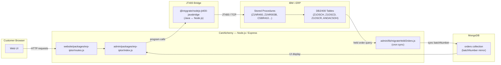
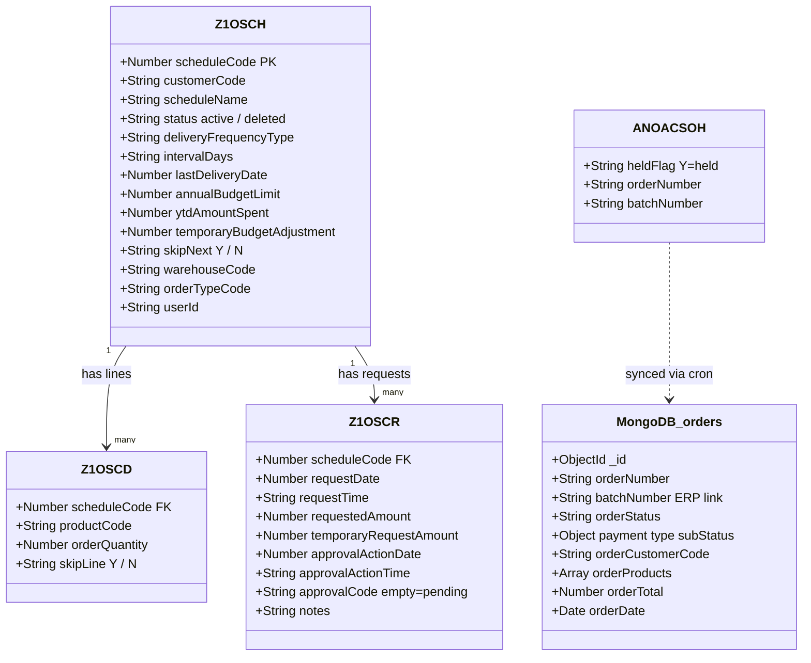
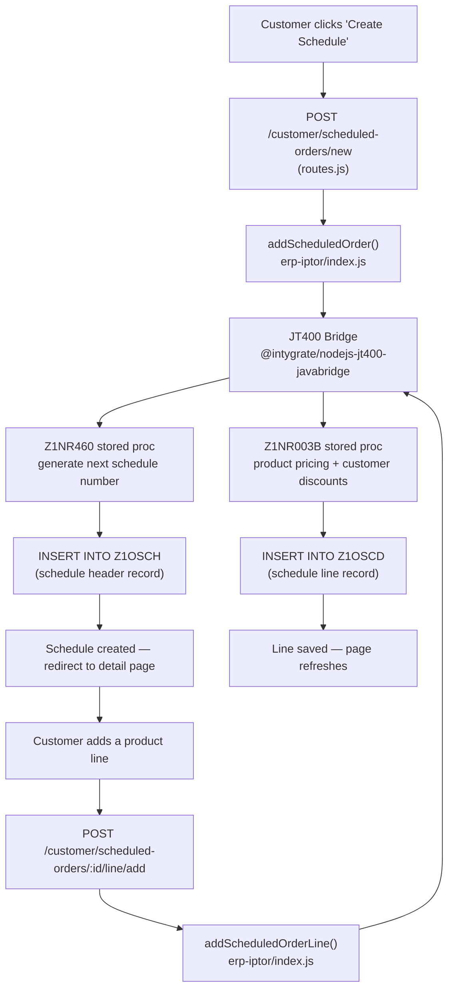
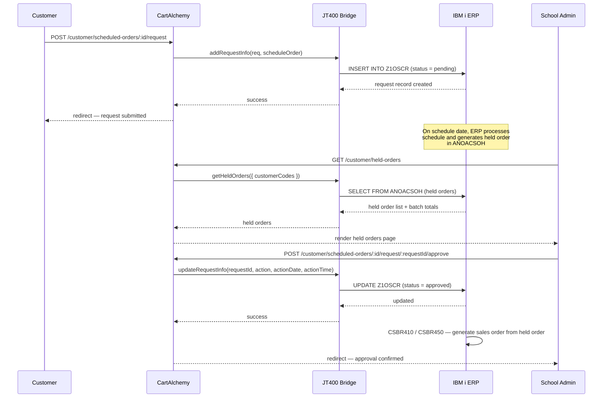
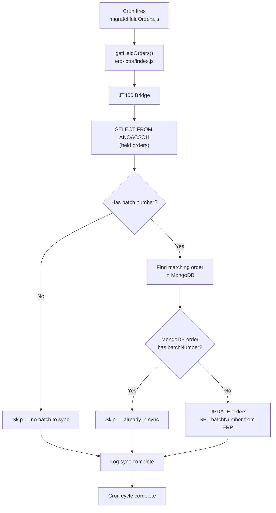
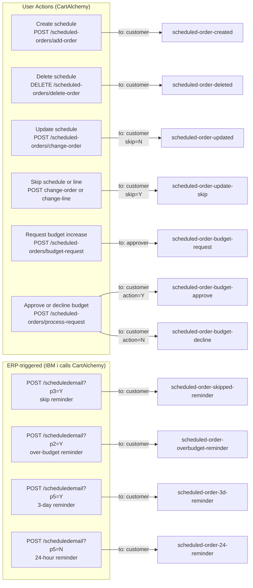

# CartAlchemy — Scheduled Orders Architecture

I led end-to-end delivery of the Scheduled Orders feature for CartAlchemy v1 — a B2B e-commerce platform serving the education sector. The feature lets customers create recurring product orders with configurable frequency, per-order budget limits, a budget increase request and approval workflow, and a full email notification lifecycle. Orders are fulfilled automatically by the ERP on schedule; CartAlchemy provides the UI layer on top.

The key technical challenge was that **all schedule data lives in IBM i (AS400) DB2/400 tables** — CartAlchemy never owns that data. The Node.js application communicates with IBM i exclusively through a custom JT400 Java bridge (`@intygrate/nodejs-jt400-javabridge`), calling stored procedures and executing SQL directly against DB2/400. MongoDB's role is narrow: it mirrors a subset of held order data (batch numbers) via a cron sync job to support UI display.

---

## 1. System Architecture

---

## 2. ERP Data Model

All ERP tables reside on IBM i / DB2/400. MongoDB holds only a projection of held order data for UI purposes.

> **Note:** Z1OSCH, Z1OSCD, Z1OSCR, and ANOACSOH all live on IBM i / DB2/400. MongoDB_orders is a CartAlchemy-side mirror — batch numbers are the only ERP field synced into it.

---

## 3. Schedule Creation & Line Management

---

## 4. Order Request & Approval Workflow

---

## 5. Held Orders Cron Sync

`migrateHeldOrders.js` runs on a schedule to keep MongoDB batch numbers in sync with IBM i. This is a one-way sync — ERP is always the source of truth.

---

## 6. Email Notifications

Email is sent via a shared `sendEmail` / `getEmailTemplate` utility from `@cartalchemy/common/email`. Scheduled orders have two distinct trigger sources: user actions in the UI (transactional), and callbacks from the IBM i ERP system (automated reminders).

### Trigger Sources

### Email Template Reference

| Template | Subject | Recipient | Trigger |
|----------|---------|-----------|---------|
| `scheduled-order-created` | Scheduled Order Created | Customer | Schedule created in UI |
| `scheduled-order-deleted` | Scheduled Order Deleted | Customer | Schedule deleted in UI |
| `scheduled-order-updated` | Scheduled Order Updated | Customer | Schedule settings changed |
| `scheduled-order-update-skip` | Scheduled Order Updated | Customer | Skip flag set on schedule or line |
| `scheduled-order-budget-request` | Scheduled Order Budget Request | **Approver** | Customer requests budget increase |
| `scheduled-order-budget-approve` | Scheduled Order Budget Approved | Customer | Approver approves budget request |
| `scheduled-order-budget-decline` | Scheduled Order Budget Declined | Customer | Approver declines budget request |
| `scheduled-order-skipped-reminder` | MTA Scheduled Order - {code} | Customer | ERP: order set to skip |
| `scheduled-order-overbudget-reminder` | MTA Scheduled Order - {code} | Customer | ERP: order exceeds budget |
| `scheduled-order-3d-reminder` | MTA Scheduled Order - {code} | Customer | ERP: 3 days before order processes |
| `scheduled-order-24-reminder` | MTA Scheduled Order - {code} | Customer | ERP: 24 hours before order processes |

**ERP-triggered emails:** The IBM i system calls `POST /scheduledemail` directly with query parameters (`p1`–`p5`) to select the template. CartAlchemy resolves the customer email by looking up the customerCode from the schedule record in DB2, then dispatches the appropriate template — the ERP drives the notification timing, CartAlchemy handles delivery.

**Approver routing:** Budget request emails go to the approver email fetched via `getApproverEmailForScheduledOrder()`, not to the customer. Approval/decline responses then go back to the customer.

---

## Key File Reference

| File | Purpose |
|------|---------|
| `/admin/packages/erp-iptor/index.js` | Core ERP integration — all schedule CRUD and ERP queries (~6000 lines) |
| `/website/packages/erp-iptor/routes.js` | Express route definitions for scheduled orders UI |
| `/website/packages/erp-iptor/index.js` | Website package init and nav config |
| `/admin/lib/migrateHeldOrders.js` | Cron job — syncs ERP batch numbers into MongoDB |
| `/admin/packages/erp-iptor/programs/z1nr460.js` | Stored proc wrapper — generate schedule number |
| `/admin/packages/erp-iptor/programs/z1nr003b.js` | Stored proc wrapper — product pricing |
| `/admin/packages/erp-iptor/programs/csbr410.js` | Stored proc wrapper — order operations |
| `/admin/packages/erp-iptor/programs/z1nr205.js` | Stored proc wrapper — order line operations |
